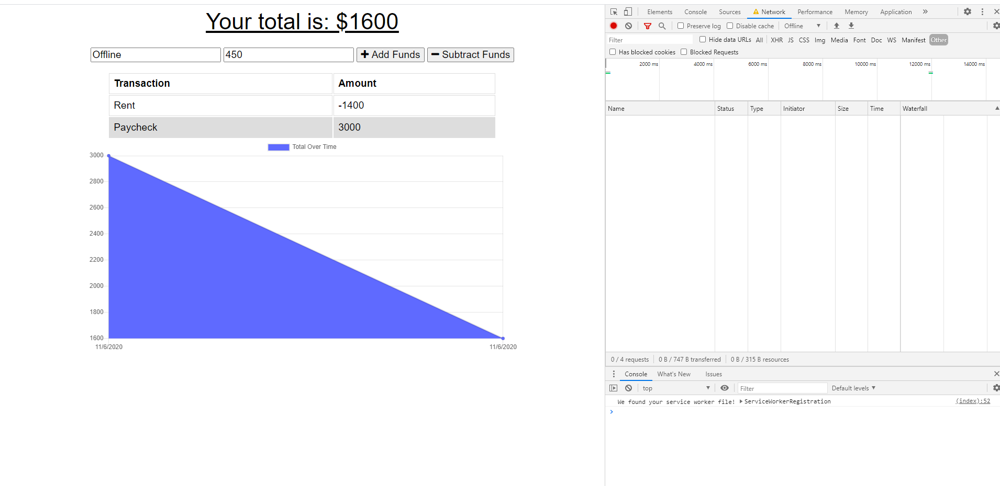
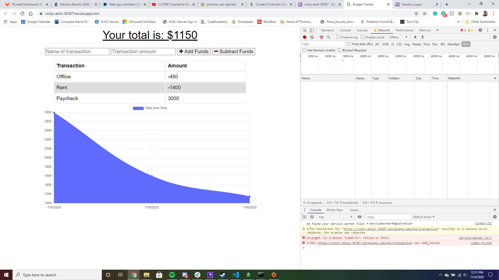
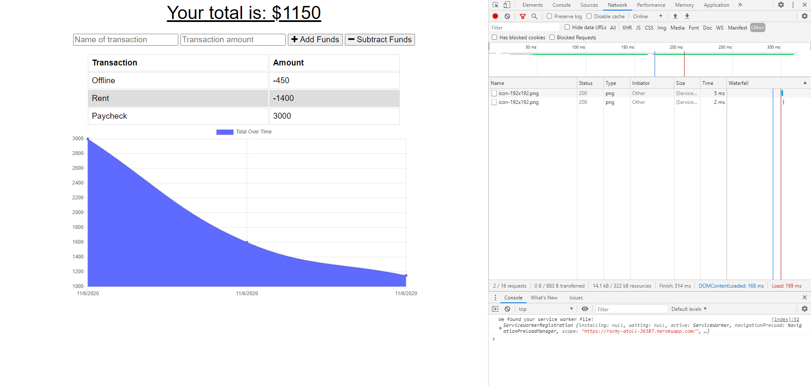

# BudgetTracker

# BudgetTracker
This program adds offline functionality to a Budget Tracker to allow users to track expenses and deposits to their budget with or without a connection.

# Workout Tracker
  
  ## Table of Contents
  [Description](#description)

  [Installation](#installation)

  [Usage](#usage)

  [License](#license)

  [Questions](#questions)
  ## Description
  The user will be able to add expenses and deposits to their budget with or without a connection. When entering transactions offline, they should populate the total when brought back online.<br> 
  Heroku link:<br>
  [Heroku](https://rocky-atoll-36387.herokuapp.com/)

  ## Installation
  Developers may install dependencies within the package.json file with the following command in your terminal:
  ```bash
  npm install
  ```
  The dependencies include compression, express, lite-server, mongoose, and morgan.
  ## Usage
  The user will begin by typing the name of their transaction, a transaction amount, and indicating whether it is adding funds (deposit) or subtracting funds (expense).<br><br>
  
  The user can then turn their network offline (this can be done in the network tab) and can place another transaction into the database.<br><br>
  
  While offline, the data will not transfer to the database but will be stored offline instead. When the user returns online, the new data will remain displayed on the screen and be added into the database.
  
  ## License
  MIT
  ## Questions
  For any further questions, you may contact me at:<br>
  github: http://github.com/mgmoreno22<br>
  email: MichaelMoreno751@gmail.com